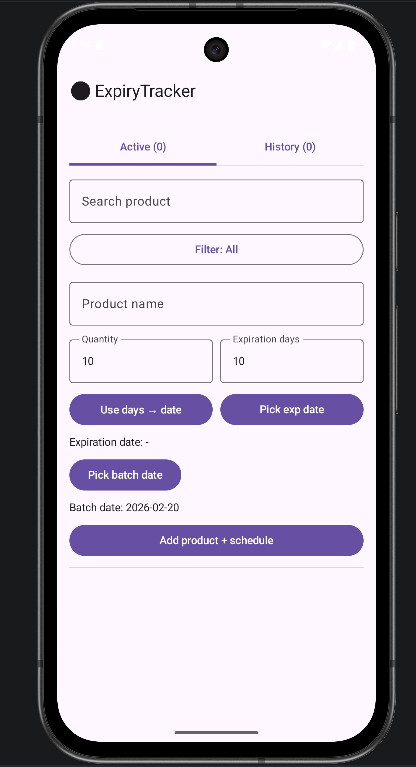
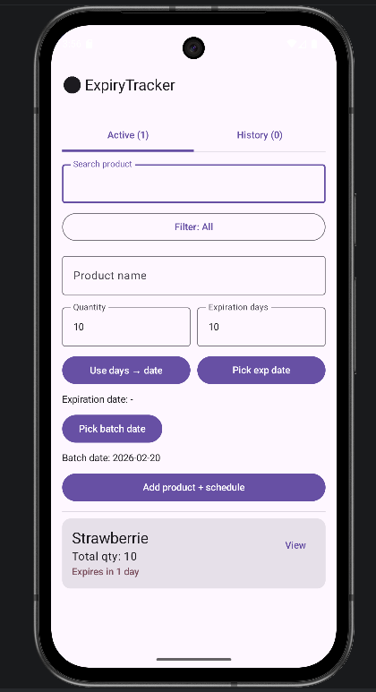
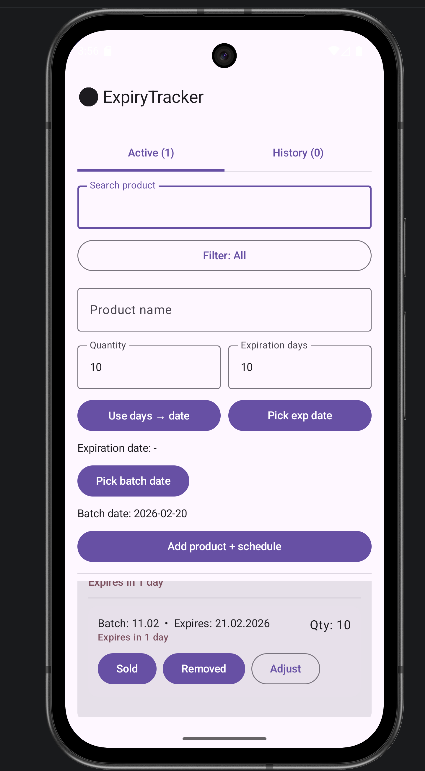
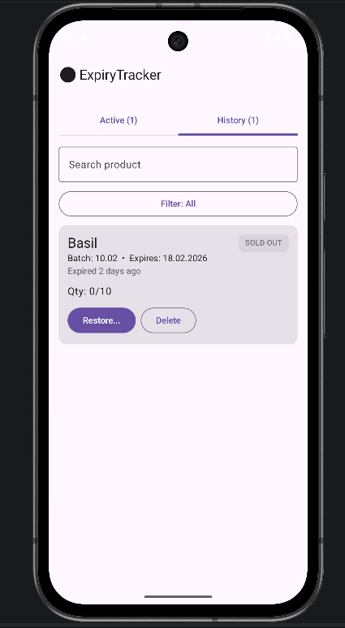

# ExpiryTracker 🥦⏰

A simple Android app to track product batches and expiration dates in a real market workflow.

✅ Batch-based inventory (same product can arrive every day with different expiry)  
✅ Notifications for expiration (today + 2 days before)  
✅ Active / History tabs (sold out & removed go to History)  
✅ Search + Filter (Expired / Today / Next 2 days / Next 7 days)  
✅ Multi-language UI: English, Russian, Armenian  
✅ Android 12+ Splash Screen + App Icon

---

## Screenshots

| Start | Active (Group) | Batch details | History |
|------|-----------------|--------------|---------|
|  |  |  |  |

---

## How it works

Each delivery creates a **new batch** record:
- Product name
- Batch date
- Expiration date
- Quantity

The Active tab groups batches by product name and shows total quantity, with expandable batch list.

When quantity becomes **0** (Sold out) or status is **Removed**, the batch goes to **History**.

---

## Download (APK)

Check **Releases** to download the latest APK.

---

## Build & Run

1. Open the project in **Android Studio**
2. Let Gradle sync
3. Run on emulator or device

---

## Tech Stack

- Kotlin
- Jetpack Compose (Material 3)
- WorkManager (background scheduling)
- AndroidX SplashScreen (Android 12+)
- SharedPreferences + JSON (simple local storage)

---

## Notes

- On Android 13+ the app requests notification permission.
- Keystore files are not included in the repository.
